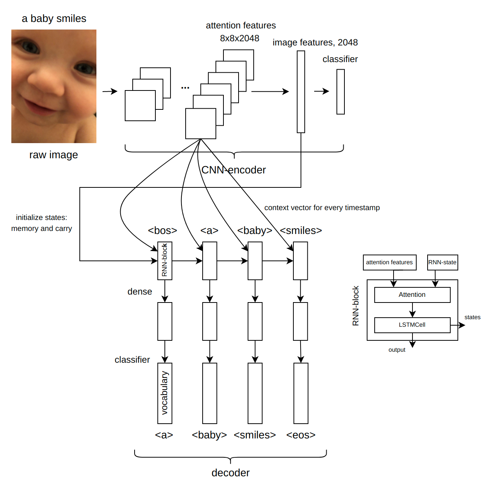

# **Image Captioning**

 
 
This is the final project from Deep learning school (or DLS), part_2.  
 
 
Image captioning is a text description of image.  
Model takes raw image (i.e. .jpg), extract CNN-features and use these features in RNN. RNN returns logits for tokens (words). Logits are converted to probabilty. Beam search (or any other) uses probability to get image description (caption).   
 
This repository contains jupyter notebook with model training, pretrained model (encoder-decoder), demonstration notebook and brief summary .pdf (on russian).

 
Check out model by clicking on icon:   

  

or open `demo.ipynb` in Google Collab.
